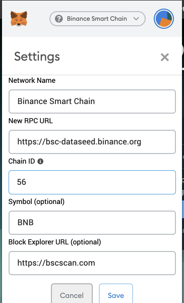

<div id="top"></div>
<!--
*** Thanks for checking out the Best-README-Template. If you have a suggestion
*** that would make this better, please fork the repo and create a pull request
*** or simply open an issue with the tag "enhancement".
*** Don't forget to give the project a star!
*** Thanks again! Now go create something AMAZING! :D
-->


<!-- PROJECT SHIELDS -->
<!--
*** I'm using markdown "reference style" links for readability.
*** Reference links are enclosed in brackets [ ] instead of parentheses ( ).
*** See the bottom of this document for the declaration of the reference variables
*** for contributors-url, forks-url, etc. This is an optional, concise syntax you may use.
*** https://www.markdownguide.org/basic-syntax/#reference-style-links
-->
[![Contributors][contributors-shield]][contributors-url]
[![Forks][forks-shield]][forks-url]
[![Stargazers][stars-shield]][stars-url]
[![Issues][issues-shield]][issues-url]
[![MIT License][license-shield]][license-url]
[![LinkedIn][linkedin-shield]][linkedin-url]


<!-- PROJECT LOGO -->
<br />
<div align="center">

<h3 align="center">NekoCoin smartcontract</h3>

  <p align="center">
    A draft ERC20 Neko Token used for learning purpose.
    <br />
    Can be deploy to Binance Smart Chain Testnet
  </p>
</div>


<!-- TABLE OF CONTENTS -->
<details>
  <summary>Table of Contents</summary>
  <ol>
    <li>
      <a href="#getting-started">Getting Started</a>
      <ul>
        <li><a href="#prerequisites">Prerequisites</a></li>
        <li><a href="#installation">Installation</a></li>
      </ul>
    </li>
    <li><a href="#license">License</a></li>
    <li><a href="#contact">Contact</a></li>
    <li><a href="#acknowledgments">Acknowledgments</a></li>
  </ol>
</details>

<!-- GETTING STARTED -->
## Getting Started

The frontend which interact with this token is in this [Neko Web3 repo  ](https://github.com/tungdt-90/neko-coin-web3). Clone that repo if you want to see some actions.

### Prerequisites
- You're probably going to need [NodeJS LTS](https://nodejs.org/en/download/) to use this source code.
- You will need to install [Metamask](https://metamask.io/). Head [over here](https://metamask.io/download) and install it on your browser.
- [Truffle framework](https://trufflesuite.com/) for testing local and deploy to some testnet.

- Install NPM or Yarn globally
  * npm
    ```sh
    npm install npm@latest -g
    ```
  * yarn is optional (recommended)
    ```
    npm install yarn -g
    ```

### Installation

_Please follow these steps._

1. Clone the repo
   ```sh
   git clone https://github.com/tungdt-90/neko-token-smartcontract
   ```
2. Go into the folder you just clone
    ```
    cd neko-token-smartcontract
    ``` 
   and install NPM packages:

   * npm
     ```
     npm install
     ```
   * yarn
     ```
     yarn install
     ```
3. Start truffle
    ```
    truffle develop
    ```
    Copy you _**mnemonic**_, paste it into `.secret` file in this source code. It will be used to import account in Metamask wallet and deploy to BSC Testnet with that account.
    
    After that, keep the window opens.
4. Now you will need to **Connect Your MetaMask With Binance Smart Chain Testnet**.
   
   - Open Metamask, choose `import using Secret Recovery Phrase` and use the *mnemonic* which you saved before (Check `.secret` file if you forgot)
   
   - Open Metamask > Settings > Network > Custom RPC and enter these values:
     
     ```
     Network Name: BSC Testnet
     RPC URL: https://data-seed-prebsc-1-s2.binance.org:8545/
     ChainID: 97
     Symbol: BNB
     Block Explorer: https://testnet.bscscan.com
     ```
   - Choose Account 1 > Copy address,
   - Go to faucet page: https://testnet.binance.org/faucet-smart, then paste your address in the box and click on “Give me BNB”
   - Check if your account received BNB or not.
5. Deploy to Binance Smart Chain Testnet
    - Now, let's go back to the truffle terminal, enter these commands (wait for it to finish before run the next command) 
      ```
      compile
      ```
      ```
      migrate
      ```
      ```
      deploy --network bscTestnet
      ```
      If you think last step is not working, `Ctrl + C` to exit the truffle terminal, then run:
      ```
      truffle deploy --network bscTestnet
      ```
6. Now, let's check if the new tokens is online or not !!!
    - From this source code, open folder `build > contracts > NekoCoin.json`
    - Find `"networks"`. 97 is the id of BSC Testnet, copy value of `address` in 97.
    - Open Metamask, choose `Account 1` and network `BSC Testnet`, select `import tokens`
    - Paste the token address you just copy, and enjoy your 1M NKT token.
    

<p align="right">(<a href="#top">back to top</a>)</p>

<!-- LICENSE -->
## License

Distributed under the MIT License. See `LICENSE.txt` for more information.

<p align="right">(<a href="#top">back to top</a>)</p>


<!-- CONTACT -->
## Contact

Tung Do - [tungdt5490@gmail.com](mailto:tungdt5490@gmail.com)

Project Link: [https://github.com/tungdt-90/neko-coin-web3](https://github.com/tungdt-90/neko-coin-web3)

<p align="right">(<a href="#top">back to top</a>)</p>

<!-- ACKNOWLEDGMENTS -->
## Acknowledgments

Use this space to list resources you find helpful and would like to give credit to. I've included a few of my favorites to kick things off!

* [Binance Testnet](https://testnet.binance.org/en/)
* [Truffle](https://www.trufflesuite.com/)
* [Openzeppelin](https://openzeppelin.com/)
* [Metamask](https://metamask.io/)
* [Img Shields](https://shields.io)

<p align="right">(<a href="#top">back to top</a>)</p>


<!-- MARKDOWN LINKS & IMAGES -->
<!-- https://www.markdownguide.org/basic-syntax/#reference-style-links -->
[contributors-shield]: https://img.shields.io/github/contributors/tungdt-90/neko-coin-web3.svg?style=for-the-badge
[contributors-url]: https://github.com/tungdt-90/neko-coin-web3/graphs/contributors
[forks-shield]: https://img.shields.io/github/forks/tungdt-90/neko-coin-web3.svg?style=for-the-badge
[forks-url]: https://github.com/tungdt-90/neko-coin-web3/network/members
[stars-shield]: https://img.shields.io/github/stars/tungdt-90/neko-coin-web3.svg?style=for-the-badge
[stars-url]: https://github.com/tungdt-90/neko-coin-web3/stargazers
[issues-shield]: https://img.shields.io/github/issues/tungdt-90/neko-coin-web3.svg?style=for-the-badge
[issues-url]: https://github.com/tungdt-90/neko-coin-web3/issues
[license-shield]: https://img.shields.io/github/license/tungdt-90/neko-coin-web3.svg?style=for-the-badge
[license-url]: https://github.com/tungdt-90/neko-coin-web3/blob/master/LICENSE.txt
[linkedin-shield]: https://img.shields.io/badge/-LinkedIn-black.svg?style=for-the-badge&logo=linkedin&colorB=555
[linkedin-url]: https://www.linkedin.com/in/tungdt90/
